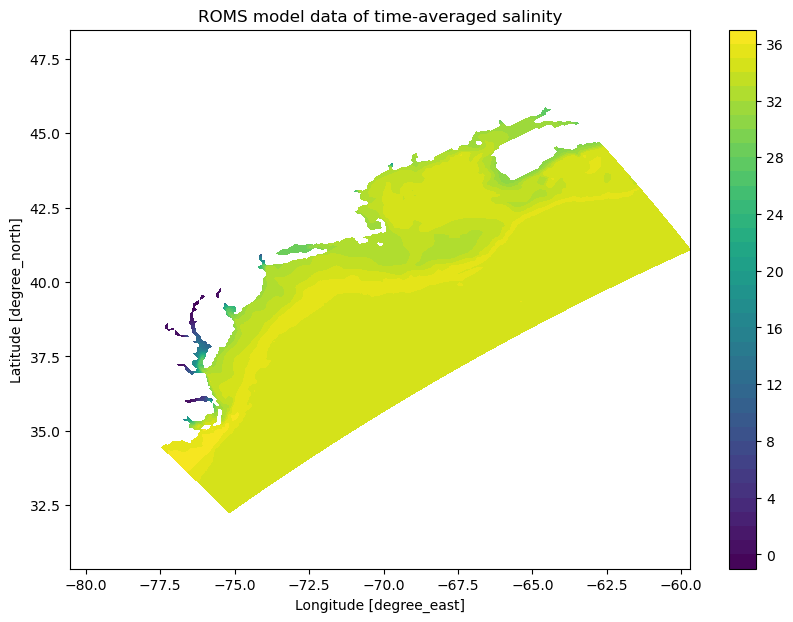

`pymt_roms <https://github.com/gantian127/pymt_roms/>`_ is a package that converts
`bmi_roms <https://github.com/gantian127/bmi_roms>`_ package into a reusable,
plug-and-play data component for `PyMT <https://pymt.readthedocs.io/en/latest/?badge=latest>`_ modeling framework
developed by Community Surface Dynamics Modeling System (`CSDMS <https://csdms.colorado.edu/wiki/Main_Page>`_).
This allows `ROMS model <https://www.myroms.org/>`_ datasets
to be easily coupled with other datasets or models that expose a `Basic Model Interface <https://bmi.readthedocs.io/en/latest/>`_.

The current implementation supports 2D - 4D ROMS output datasets defined with geospatial and/or time dimensions (e.g.,
dataset defined with dimensions as [time, s_rho, eta_rho, xi_rho])

---------------
Installing pymt
---------------

Installing `pymt` from the `conda-forge` channel can be achieved by adding
`conda-forge` to your channels with:

.. code::

  conda config --add channels conda-forge

*Note*: Before installing `pymt`, you may want to create a separate environment
into which to install it. This can be done with,

.. code::

  conda create -n pymt python=3
  conda activate pymt

.. Once the `conda-forge` channel has been enabled, `pymt` can be installed with:

Once the environment is activated, `pymt` can be installed with the following command.
Please note that the `pymt_roms` requires the development version of `pymt` (e.g., v1.3.2dev0).

.. code::

    pip install git+https://github.com/csdms/pymt.git

..  conda install pymt

.. It is possible to list all of the versions of `pymt` available on your platform with:

.. .. code::

..  conda search pymt --channel conda-forge

--------------------
Installing pymt_roms
--------------------

To install `pymt_roms`, use pip

.. code::

  pip install pymt_roms

or conda

.. code::

  conda install -c conda-forge pymt_roms

--------------------
Coding Example
--------------------
You can learn more details about the coding example from the
`tutorial notebook <https://github.com/gantian127/pymt_roms/blob/master/notebooks/pymt_roms.ipynb>`_.

.. code-block:: python

    import matplotlib.pyplot as plt
    import numpy as np

    from pymt.models import roms

    # initiate a data component
    data_comp = roms()
    data_comp.initialize('config_file.yaml')

    # get variable info
    for var_name in data_comp.output_var_names:
        var_unit = data_comp.var_units(var_name)
        var_location = data_comp.var_location(var_name)
        var_type = data_comp.var_type(var_name)
        var_grid = data_comp.var_grid(var_name)
        var_itemsize = data_comp.var_itemsize(var_name)
        var_nbytes = data_comp.var_nbytes(var_name)

        print('variable_name: {} \nvar_unit: {} \nvar_location: {} \nvar_type: {} \nvar_grid: {} \nvar_itemsize: {}'
            '\nvar_nbytes: {} \n'. format(var_name, var_unit, var_location, var_type, var_grid, var_itemsize, var_nbytes))

    # get time info
    start_time = data_comp.start_time
    end_time = data_comp.end_time
    time_step = data_comp.time_step
    time_units = data_comp.time_units
    time_steps = int((end_time - start_time)/time_step) + 1

    print('start_time: {} \nend_time: {} \ntime_step: {} \ntime_units: {} \ntime_steps: {}'.format(
            start_time, end_time, time_step, time_units, time_steps))

    # get variable grid info
    for var_name in data_comp.output_var_names:
        grid_id = data_comp.var_grid(var_name)
        grid_type = data_comp.grid_type(grid_id)
        grid_rank = data_comp.grid_ndim(grid_id)
        grid_shape = data_comp.grid_shape(grid_id)
        grid_spacing = data_comp.grid_spacing(grid_id)
        grid_origin = data_comp.grid_origin(grid_id)

        print('var_name: {} \ngrid_id: {} \ngrid_type: {} \ngrid_rank: {} \ngrid_shape: {} \ngrid_spacing: {} \ngrid_origin: {} \n'.format(
            var_name, grid_id, grid_type, grid_rank, grid_shape, grid_spacing, grid_origin))

    # get variable data
    data = data_comp.get_value('time-averaged salinity')
    data_3D = data.reshape([40, 106, 242])

    # get lon and lat data
    lat = data_comp.get_value('latitude of RHO-points').reshape([106, 242])
    lon = data_comp.get_value('longitude of RHO-points').reshape([106, 242])

    # make a contour plot
    fig = plt.figure(figsize=(10,7))
    im = plt.contourf(lon, lat, data_3D[0], levels=36)
    fig.colorbar(im)
    plt.axis('equal')
    plt.xlabel('Longitude [degree_east]')
    plt.ylabel('Latitude [degree_north]')
    plt.title('ROMS model data of time-averaged salinity')

|tif_plot|

.. links:

.. |binder| image:: https://mybinder.org/badge_logo.svg
 :target: https://mybinder.org/v2/gh/gantian127/pymt_roms/master?filepath=notebooks%2Fpymt_roms.ipynb

